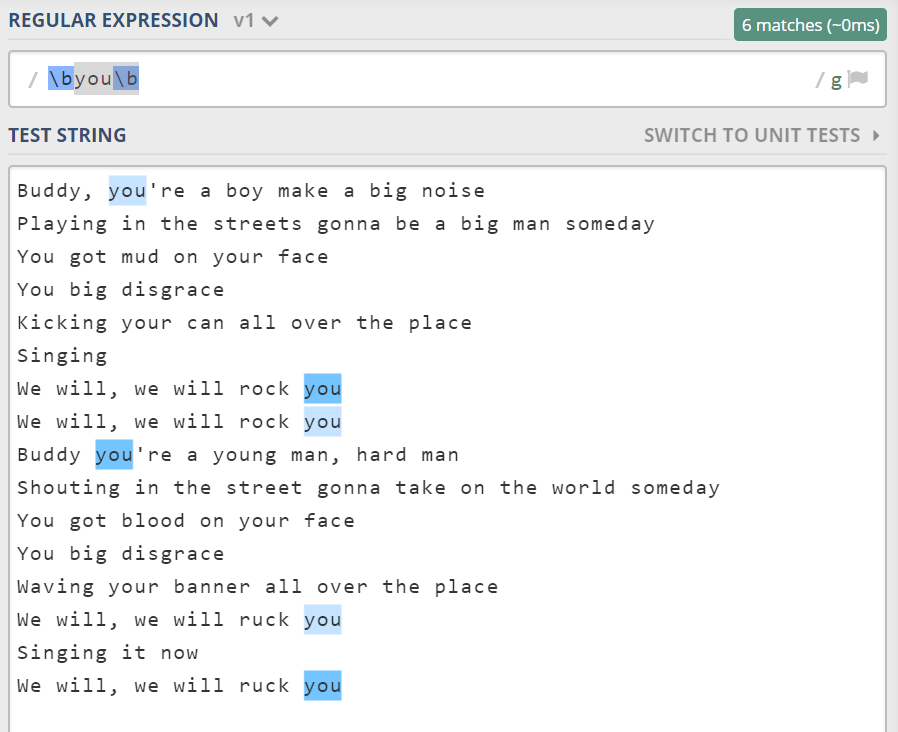

# 正则相关

## 历史局限

ECMAScript 3 规定，同一段代码表示的正则对象，每次返回都是相同的对象

ECMAScript 5 规定，代码表示的正则对象，每次都返回新对象

Safari 5 及以前版本、Chrome 7 及以前版本对正则执行 typeof 存在兼容问题，返回 function

## 量词

`{n,m}`表示至少出现`n`次，至多出现`m`次(包括`n`和`m`)

### 简写形式

+ `*` 等价于{0,}。即任意多个。
+ `+` 等价于{1,}。即至少一个
+ `?` 等价于{0,1}。即有一个或者没有
+ `{m}` 等价于{m,m}

以上均为`贪婪量词`，像巴蛇吞象那样，一口吞下整个字符串，发现吞不下（匹配不了），再从后面一点点吐出来（去掉最后一个字符，再看这时这个整个字符串是否匹配，不断这样重复直到长度为零）

### 惰性量词

在量词后面加`?`

+ `\*?`
+ `\+?`
+ `??`
+ `{n,m}?`

`惰性量词`,由于太懒了，先吃了前面第一个字符，如果不饱再捏起多添加一个（发现不匹配，就读下第二个，与最初的组成一个有两个字符串的字符串再尝试匹配，如果再不匹配，再吃一个组成拥有三个字符的字符串……）

## 模糊匹配

+ `[...]` 方括号内的任意字符
+ `[^...]` 不在方括号内的任意字符
+ `\d` 等价于 [0-9]。表示是一位数字。digit 的首字母。
+ `\D` 等价于 [^0-9]。
+ `\w` 等价于 [0-9a-zA-Z_]。表示数字、大小写字母和下划线。word的首字母，也称单词字符。
+ `\W` 等价于 [^0-9a-zA-Z_]。
+ `\s` 等价于 [ \t\v\n\r\f]。表示空白符，包括空格、水平制表符、垂直制表符、换行符、回车符、换页符。记+ 忆方式：s是space character的首字母。
+ `\S` 等价于 [^ \t\v\n\r\f]。
+ `.` 等价于[^\n\r\u2028\u2029]。点是通配符，表示几乎任意字符。
+ `[\u4e00-\u9fa5]`用于匹配汉字

## 位置匹配

### 单词边界

`\b`，单词为`boundary`。表示匹配一个位置，一边是`\w`，一边是`\W`。

`\B`，非单词边界。

一个例子：



如上图，只能匹配到`you`无法匹配到`your`

### 开头和结尾

`^`用于匹配开头位置

`$`用于匹配结尾位置

### 断言

+ `(?=exp)`:正向先行断言

```javascript
let str1 = "bedroom";
let str2 = "bedding";

 //在我们捕获bed这个字符串时，抢先去看接下来的字符串是不是room
let reBed = /(bed(?=room))/

console.log(reBed.test(str1),RegExp.$1,RegExp.$2);
// true 'bed' ''

console.log(reBed.test(str2));
// false
```

+ `(?!exp)`:负向先行断言

```javascript
let str1 = "bedroom";
let str2 = "bedding";

let reBed = /(bed(?!room))/  // bed 后面不能是room

console.log(reBed.test(str1)) //false
console.log(reBed.test(str2)) //true
```

## 选择

`|`用于分隔供选择的字符，选择项的匹配顺序是从左到右，直到发现匹配项，所以 `/a|ab/` 匹配 ab 时，只能匹配一个字符

```javascript
/(a|ab)/.test('ab')
console.log(RegExp.$1); // a
```

## 引用

同一正则表达式后部引用前面的子表达式 `\` 加数字

引用指的是对匹配的文本的引用

```javascript
/("|')[^\1]*\1+/.test(JSON.stringify('444'))

// true
```

```javascript
/**
 * 字符串去除相邻的重复项
 * 'aabbccddeexxxxaa' => 'abcdexa'
 */
function adjacentUnique(str) {
    return str.replace(/(\w)\1+/g,'$1');
}
```

## 分组

在括号前使用`?:`实现非捕获性分组

```javascript
/(?:a|ab)c/.test('abc')
console.log(RegExp.$1); // ''
```

## 属性

### 静态属性

+ `RegExp.lastMatch`
  + 上次匹配到的字符串
+ `RegExp.leftContext`
  + 匹配到的字符串之前的字符串
+ `RegExp.rightContext`
  + 匹配到的字符串之后的字符串

```javascript
let rg = /\d/g
rg.test('a1b')
console.log(RegExp.lastMatch); // 1
```

```javascript
let rg = /\d/g
'a1b2c3'.match(rg)
console.log(RegExp.lastMatch); // 3
```

```javascript
/\d+/.test('abc123def')
console.log(RegExp.leftContext); // abc
console.log(RegExp.rightContext); // def
```

### 实例属性

+ `source`  只读字符串，存储正则的文本
+ `global`  只读属性，是否全局匹配
+ `ignoreCase` 只读属性，是否忽略大小写
+ `multiline` 只读属性，是否带有修饰符m，是否多行匹配
+ `lastIndex` 可读可写的属性，字符串中的检索位置，`test/exec` 中会用到

## 方法

### test

+ 非全局匹配时
  + 不会修改`lastIndex`
+ 全局匹配时
  + 匹配成功后
    + 会修改`lastIndex`为匹配到的字符的下一位
    + 下次调用从字符串的`lastIndex`位置开始匹配
  + 匹配失败后
    + 将`lastIndex`修改为0

```javascript
let rg = /\d/g;
console.log(rg.lastIndex,rg.test('123'),rg.lastIndex);
// 0 true 1
console.log(rg.lastIndex,rg.test('abc'),rg.lastIndex);
// 1 false 0
```

### exec

+ 非全局匹配
  + 不会修改`lastIndex`
+ 全局匹配
  + 匹配成功后，`lastIndex`为匹配字符的下一位
  + 匹配失败后，`lastIndex`重置为 0

每次调用都会返回一个匹配结果，若没有匹配到，返回`null`

匹配到，返回一个数组，第一个参数为匹配的字符，余下参数为分组内容

结果数组包括如下属性: `index`(匹配到的位置)，`input`(原字符串)

```javascript
let rg = /\d+/g;

let res1 = rg.exec('123abc456')
console.log(res1); // ["123", index: 0, input: "123abc456", groups: undefined]
console.log(rg.lastIndex) //3

let res2 = rg.exec('123abc456')
console.log(res2); // ["456", index: 6, input: "123abc456", groups: undefined]
console.log(rg.lastIndex) // 9
```

### match

字符串中的方法，接收一个正则对象，不会读取和修改`lastIndex`

+ 非全局匹配
  + 与`exec`方法返回结构一致
+ 全局匹配
  + 返回一个数组
  + 其中包含所有匹配的字符结构
+ 没有匹配上
  + 返回`null`

```javascript
'123abc456'.match(/(\d)+/g); 
//[ '123', '456' ]
'123abc456'.match(/(\d)+/);
//["123", "3", index: 0, input: "123abc456", groups: undefined]
```

### search

字符串中的方法，接收一个正则对象，不会读取和修改`lastIndex`

返回字符串中，第一个匹配项的索引

如果匹配不到，返回`-1`

始终从开头像后查找

```javascript
'123'.search(/2/) // 1
'123'.search(/4/) // -1
```

### replace

字符串中的方法，接收两个参数

+ 第一个参数
  + 普通字符串
    + 字符串不会转化为正则对象
    + 无法做到全局替换
  + 正则对象
    + 使用 g 进行全局替换
+ 第二个参数
  + 字符串
    + 可使用特殊字符序列
      + $$ 指代 $
      + $& 指代 RegExp.lastMatch
      + $' 指代 RegExp.leftContext
      + $` 指代 RegExp.rightContext
      + $n 指代正则所匹配的分组内容
  + 函数
    + 第一个参数:
      + 匹配到的子字符串
    + 中间参数:
      + 捕获分组的内容
    + 倒数第二个参数:
      + 匹配的字符串的开始索引
    + 最后一个参数:
      + 原始字符串

```javascript
'abc123def'.replace(/([a-z]+)/g,function(){
    console.log(arguments)
})
// [Arguments] { '0': 'abc', '1': 'abc', '2': 0, '3': 'abc123def' }
// [Arguments] { '0': 'def', '1': 'def', '2': 6, '3': 'abc123def' }
```